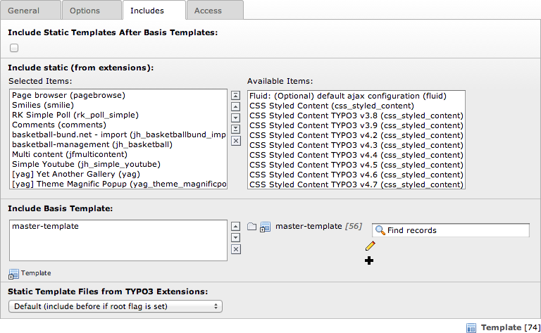

.. ==================================================
.. FOR YOUR INFORMATION
.. --------------------------------------------------
.. -*- coding: utf-8 -*- with BOM.

.. ==================================================
.. DEFINE SOME TEXTROLES
.. --------------------------------------------------
.. role::   underline
.. role::   typoscript(code)
.. role::   ts(typoscript)
   :class:  typoscript
.. role::   php(code)

Administration
--------------

To use this theme, just include static '[yag] Theme Magnific Popup' to
your template.

**Attention** : This Extension uses 'page.jsFooterInline' in
TypoScript. If you use an other extension that uses this command (like
EXT:perfectlightbox or EXT:t3colorbox) make shure you include the
static template of '[yag] Theme Magnific Popup' at last.

